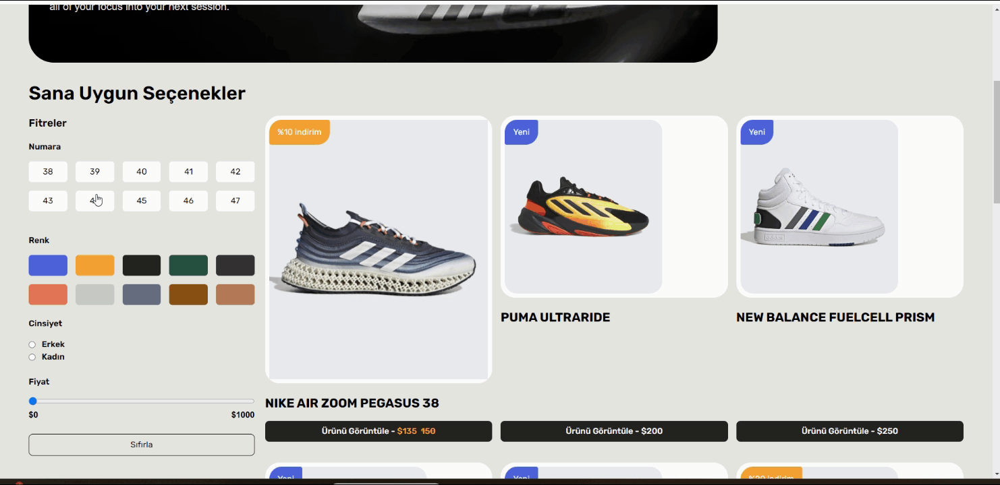

# Tanstack Query Shoes App

# Bilgilendirme 1

- Burada json-server renk dahilindeki like parametresini desteklemiyor.
- Bu sebeple son sürümünü kullanmadık
- Tailwind içerisinde css oluşturuldu
- Figma baz alınarak oluşturulan projemide ikonumuz uzantı yolu ile çekilmiştir.

https://www.figma.com/design/cm3E3wIQ9tiTv0Niybhhwk/Kicks---Shoes-eCommerce-website-and-admin-MVP-(Community)?node-id=0-1&node-type=CANVAS&t=1kiqpBp5VigQwUMw-0

# Bilgilendirme 2

- json-server@0.17.4
- json-server --watch db.json --port 3000 ile çalıştırılır
- tanstackquery kullanabilmek için app bileşenini sarmalamamız gerekiyor.
- @uidotdev/usehooks
- xss

# Teknolojiler

- react
- typescript

# Kütüphaneler

- react-router-dom
- tailwind
- axios
- json-server
- @tanstack/react-query
- react-toastify

# Ekran görüntüsü

# 
# Tanstack-Shoes-App
